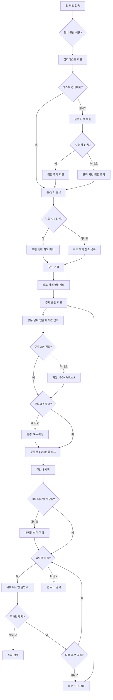

# User Flow

## 전체 흐름

## 구간별 설명

### 1. 취향 분석 온보딩
최초 접속 → 위치 권한 처리 → 심리테스트 → AI 또는 규칙 기반 취향 결과

### 2. 장소 발견 및 추천
홈 → 추천 축제/지도 → API 실패 시 대체 목록 → 장소 상세

### 3. 주차 플랜
방문 시간 입력 → 주변 후보 수집 → 3개 미만이면 5km까지 확대 → 1·2·3순위 표시

### 4. 길안내 및 만차 전환
내비게이션 선택 → 딥링크 → 만차 시 다음 후보 → 모두 소진 시 재탐색

### 5. 장애 대체
외부 API 실패, 지도 실패, 위치 권한 거절 상황에서도 저장 데이터와 기본값으로 핵심 흐름을 유지합니다.
